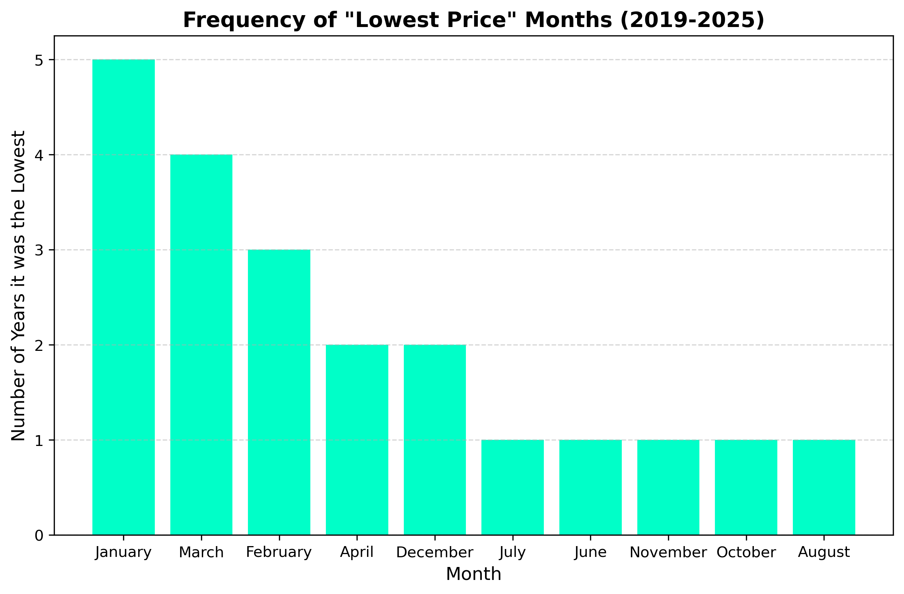
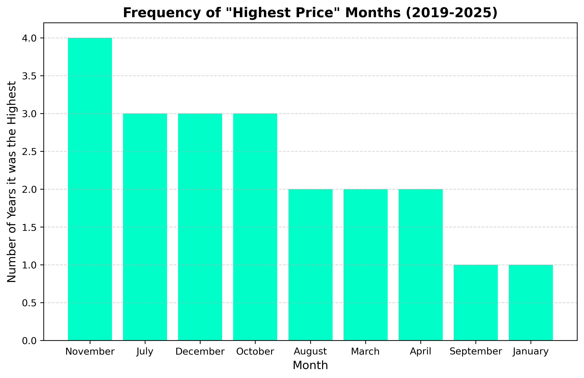

# 📈 Bitcoin Seasonal Price Analysis (2019–2025)

### **A Data-Driven Guide to Market Timing & Infrastructure Scaling**

## 📌 Project Overview

This project analyzes historical Bitcoin price data from **2019 to 2025** to identify recurring seasonal trends. The goal is two-fold:

1. **For Traders:** Determine statistically significant "Buy" and "Sell" windows to maximize profitability.
2. **For Exchanges (e.g., Bitnob):** Predict periods of high user activity to optimize server uptime and infrastructure scaling.

**Current Scope:** Analysis of USD/BTC price action.

---

## 📊 Data Sources

* **2019 – July 2025:** Historical data sourced from [Kaggle](https://www.kaggle.com/).
* **August 2025 – End of 2025:** Supplemental real-time data sourced from **CoinGecko**.

---

## 🔍 Key Observations

After aggregating daily price averages and analyzing monthly performance over a 7-year period, the following trends emerged:

### 1. The "Accumulation" Window (Q1)

* **Observation:** January, February, and March consistently record the lowest average prices of the year.
* **Stat:** January ranked in the "lowest price tier" **5 out of 7 times**.
* **Insight:** The first quarter (Q1) is historically the market's "cooling off" period, making it the optimal time for accumulation.

> 
> A bar chart showing the frequency of each month appearing in the "Lowest Price" category.*

### 2. The "Profit Taking" Window (Q4)

* **Observation:** The second half of the year—specifically July, October, and November—shows the strongest price action.
* **Stat:** **November** has a **57.1% probability** (4 out of 7 years) of hosting the highest price peak of the year.
* **Insight:** Market momentum tends to peak in Q4, signaling a prime window for selling assets.

> 
> A bar chart showing the frequency of each month appearing in the "Highest Price" category with November topping the chart.*

---

## 💡 Business Recommendations for Bitnob

Based on the volatility and volume correlation associated with these price movements, I recommend the following for exchange operations:

| Season                          | User Behavior Prediction           | Operational Recommendation                                                                                                                 |
| :------------------------------ | :--------------------------------- | :----------------------------------------------------------------------------------------------------------------------------------------- |
| **Q1 (Jan - Mar)**        | High "Buy" Volume (Dip Buying)     | **Maximize Uptime:** Ensure deposit gateways (Fiat-to-Crypto) are fully optimized for inflow.                                        |
| **Q4 (Specifically Nov)** | High "Sell" Volume (Profit Taking) | **Liquidity Management:** Ensure sufficient liquidity providers are active to handle high withdrawal/sell-pressure without slippage. |

---

## 🛠 Tech Stack

* **Python:** Core analysis.
* **Pandas:** Data cleaning, manipulation, and time-series aggregation.
* **Matplotlib:** Trend visualization.
* **Jupyter Notebook:** Interactive development environment.

---

## ⚠️ Limitations & Future Work

* **Currency Constraint:** This analysis currently uses **USD**. A future iteration will integrate **NGN (Naira)** rates to account for local currency devaluation and arbitrage opportunities.
* **External Factors:** This model relies on historical seasonality and does not yet account for "Black Swan" events or macroeconomic shifts (e.g., halving cycles).

---
## What I learnt
I apologize that this work is coming late, I was looking for perfction rather than working tool. But now, i have learnt that your product should first work before it is perfect.